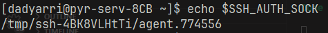

+++
title = "Использование SSH-ключей с хоста на удалённом сервере"
date = "2025-04-07"
draft = false

[taxonomies]
tags = ["SSH", "Git"]

[extra]
comment = true
+++

Недавно я узнал, что оказывается можно безопасно шерить SSH-ключи со своей машины на сервер, к которому мы подключаемся.

<!--more-->

Зачем это нужно? Как минимум для работы с Git-репозиторием. У нас сборочные сервера имеют свои собственные ключи с правами только на чтение. И мне понадобилось писать в репозиторий с сервера и тут уже возникают проблемы.

Хотел было вручную копировать свой ключ, но есть способ проще и удобнее. Немного пошаманив с конфигами, можно прокинуть хостовый ключ на сервер

В SSH-config (`$HOME/.ssh/config`) нужно прописать параметру `ForwardAgent` значение `yes`


И добавить свой приватный ключ в список доступных для форварда:

```sh
ssh-add "путь\до\ключа\.ssh\id_rsa"
```

Убедиться, что форвард агента заработал, можно, проверив переменную `$SSH_AUTH_SOCK`:



Теперь, при подключении к серверу сначала будут пробоваться ключи с хоста:


