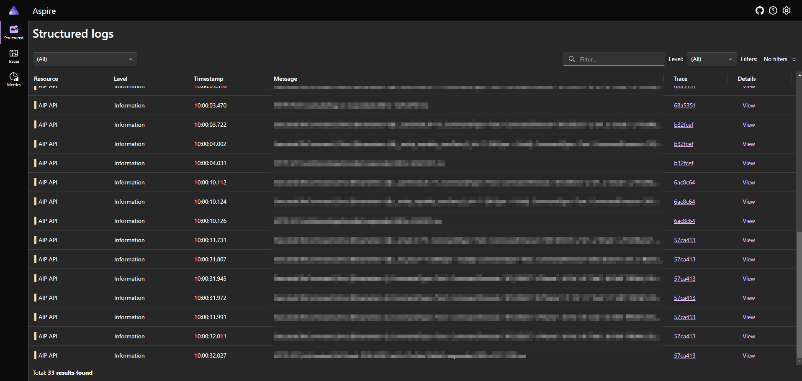

+++
title = "Использование дашборда из Aspire в бэкенде на .NET"
date = "2024-03-19"
draft = false

[taxonomies]
tags = ["C#"]

[extra]
comment = true
toc = true
og_image = "og-image.jpeg"
+++

**.NET Aspire** — это новый продукт Microsoft, который призван упростить оркестрацию контейнеров с приложениями на локальных машинах разработчиков. Кроме инструментов запуска сервисов туда ещё входит дашборд, отображающий логи и метрики приложения в реальном времени. Он использует протокол [OpenTelemetry](https://opentelemetry.io/).

В недавно вышедшем [Preview 4](https://learn.microsoft.com/en-us/dotnet/aspire/whats-new/preview-4) в числе прочего добавили возможность запустить дашборд отдельно от Aspire. В этой статье я добавлю дашборд к своему .NET-бэкенду не мигрируя весь проект на Aspire.

<!--more-->

# Запуск Docker-контейнера

Дашборд доступен в формате отдельного docker-контейнера. Он занимает два порта: на одном запускается веб-интерфейс, а на другом поднимается слушатель OpenTelemetry.

```bash
docker run --rm -it \
  -p 18888:18888 \
  -p 4317:18889 \
  -d --name aspire-dashboard \
  mcr.microsoft.com/dotnet/nightly/aspire-dashboard:8.0.0-preview.4
```

Если запустить эту команду, на порту 18888 откроется веб-интерфейс, а на порт 4317 можно будет присылать данные о работе приложения в формате OpenTelemetry по протоколу gRPC

# Настройка Nginx

Добавим доступ к веб-интерфейсу снаружи через SSL:

```conf
server {

    # Настройки SSL, домена и пр.

    location / {
        proxy_pass http://localhost:18888;
        proxy_http_version 1.1;
        proxy_set_header Host $http_host;
        proxy_set_header X-Real-IP $remote_addr;
        proxy_set_header X-Forwarded-For $proxy_add_x_forwarded_for;
        proxy_set_header X-Forwarded-Proto $scheme;
        proxy_set_header Upgrade $http_upgrade;
        proxy_set_header Connection "upgrade";
        proxy_redirect off;
    }
}
```

После перезапуска Nginx логи будут доступны на роуте /structuredlogs.

# Поддержка OTLP в Serilog

Для Serilog написан синк, который позволяет писать логи в OpenTelemetry, установим его в проект:

```bash
dotnet add package Serilog.Sinks.OpenTelemetry
```

Добавим этот синк к нашей конфигурации Serilog:

```cs
Log.Logger = new LoggerConfiguration()
  .WriteTo.Console()
  .WriteTo.OpenTelemetry(opts => {
    opts.Endpoint = "http://localhost:4317";
    opts.Protocol = OtlpProtocol.Grpc;
    opts.ResourceAttributes = new Dictionary<string, object> {
      ["service.name"] = "AIP API",
    };
  })
  .MinimumLevel.Override("Microsoft.AspNetCore", LogEventLevel.Warning)
  .MinimumLevel.Override("Default", LogEventLevel.Debug)
  .MinimumLevel.Override("Microsoft.AspNetCore.Diagnostics.ExceptionHandlerMiddleware", LogEventLevel.Verbose)
  .CreateLogger();
```

Теперь помимо консоли, приложение будет писать все логи в OpenTelemetry по указанному адресу. Выглядит это вот так:



# Заключение

В этой статье мы настроили дашборд из .NET Aspire для сбора логов по протоколу OpenTelemetry
