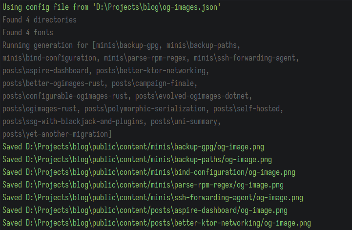

[Мигрировав](/posts/yet-another-migration) сайт обратно на Astro, я рассчитывал использовать механику интеграций для генерации Open Graph изображений. И хотя локально это работало, на продакшн сервере интеграция просто молча игнорировалась. Так что пришлось возвращаться к хранению изображений в репозитории. Для этого я написал новую утилиту, но уже на C#.

<!--more-->

# В предыдущих сериях

Пока сайт работал на Zola, я писал утилиту генерации изображений на Rust. После нескольких итераций удалось собрать рабочий инструмент, который быстро создавал изображения по дизайну из конфигурационного TOML-файла.

Впоследствии даже появилась мысль интегрировать это решение в Zola, но для этого мне пришлось бы перелопатить половину весьма запутанной кодовой базы этого генератора.

Но одновременно изучать сильно отличающийся от привычного мне язык и погружаться в весьма запутанную кодовую базу генератора оказалось слишком сложно и заняло бы слишком много времени, большая часть из которого ушла бы на борьбу с компилятором и странными ошибками, объяснения которым я найти не смог. Возможно, дело в каких-то глубинных особенностях работы на Windows.

Затем я начал упираться в возможности Zola с точки зрения фронтенда —  шаблоны постепенно разрастались и поддерживать их становилось всё сложнее. Поэтому я начал миграцию сайта обратно на Astro —  фреймворк, на котором сайт работал в прошлую свою итерацию. Я рассчитывал на то, что генерацию превью можно будет возложить на встроенный в него механизм интеграций.

Перенеся сайт, я смог заставить работать интеграцию для генерации превью. Но первый же деплой сайта на Netlify показал, что этот механизм нежизнеспособен —  интеграция просто игнорировалась. Я тогда не стал разбираться с причинами, но предположил, что дело было в ограничении на создание файлов из пользовательского кода.

Но поскольку необходимость в инструменте так и не отпала —  Astro, несмотря на свою гибкость и универсальность, не даёт возможности генерировать изображения для превью во время сборки, я решил вернуться к старому варианту с хранением изображений в репозитории и обеспечить их генерацию перед сборкой сайта на Netlify через Github Actions.

На этот раз я решил не пробовать новые технологии и использовал свой основной инструмент —  **.NET**.

Вместе с переездом на новую платформу инструмент претерпел множество функциональных изменений:

- Во-первых, я не стал сохранять использовавшийся ранее для конфигурации формат TOML, а использовал более нативный для .NET JSON.
- Во-вторых, ушла привязка к конкретному фреймворку сайта —  все необходимые директории, откуда нужно брать файлы статей, и куда сохранять готовые изображения —  легко настраивается прямо из конфига
- В-третьих, я отказался от генерации SVG-изображений перед созданием финальных PNG. Оказывается на .NET есть весьма качественная кроссплатформенная (что для меня достаточно важно) библиотека для рисования изображений напрямую `SixLabors.ImageSharp`. Перед созданием прошлой Rust-итерации я был уверен, что существует только виндовая `System.Drawing`, поэтому даже не рассматривал .NET для этого проекта.

# API

Как и в Rust итерации, новый инструмент - это консольное приложение, которое запускается из Github Actions во время пуша в ветку master. Оно обновляет превью статей, используя файл конфигурации и от имени бота коммитит изменения в репозиторий.

Отличие состоит в том, что в прошлой версии исполняемые файлы хранились прямо в репозитории. Это означало, что при изменении исходников мне приходилось не только коммитить их, но и вручную пересобирать исполняемые файлы, а затем также добавлять их в репозиторий. Теперь же приложение собирается каждый раз при запуске генерации (что, впрочем, происходит нечасто). Собранное приложение в репозиторий при этом не попадает.

Кроме того, инструмент теперь поддерживает генерацию превью для одной единицы контента. Хотя это не используется в моём воркфлоу, но может быть полезно. Для разделения этого поведения предусмотрены параметры `--all`, который запускает генерацию для всего найденного контента и `[CONTENTID]`, который находит конкретную единицу и запускает генерацию для неё.

# Конфигурация

Для работы с новым генератором в корне проекта нужно положить файл конфигурации `og-images.json`. Во многом он схож со своим TOML-предшественником, но несколько расширен:

```json
{
  "Canvas": {
    "Width": 1200,
    "Height": 630,
    "Padding": 20,
    "MaxWidth": 900,
    "VerticalAlignment": "Center",
    "Background": {
      "Image": "#images#/#item#/cover.webp",
      "FallbackColor": "34,36,54,255",
      "OverlayColor": "34,36,54,200"
    }
  }
}
```

Так, теперь можно вместе с одноцветным фоном использовать изображения, которые автоматически растянутся к размеру всего изображения. С редизайном я начал генерировать обложки для каждой из статей с помощью нейросетей, они же и стали фоном для превью.

При ошибке поиска изображения на фон автоматически будет использован одноцветный фон из `FallbackColor`

Чтобы текст не сливался с фоном можно добавить полупрозрачный верхний слой с помощью `OverlayColor`. Все приведённые цвета указываются в формате RGBA.

```json
"Content": {
  "Article": "#content#/#item#/index.md",
  "OgImage": "#images#/#item#/og-image.png"
}
```

В секции `Content` необходимо указать пути до файлов: откуда брать информацию о статье и куда складывать готовые превью.

```json
"Directories": [
  {
    "Name": "fonts",
    "Path": "public/fonts"
  },
  {
    "Name": "images",
    "Path": "public/content"
  },
  {
    "Name": "content",
    "Path": "src/data/content"
  },
  {
    "Name": "data",
    "Path": "src/data"
  }
]
```

В секции `Directories` указываются относительные пути (относительно расположения конфига), которые можно будет использовать во всём конфиге с помощью конструкции `#dir-name#`.

```json
"Fonts": [
  {
    "Name": "jbmono",
    "Path": "#fonts#/jetbrains-mono.ttf",
    "Weight": 400
  },
  {
    "Name": "jbmono-bold",
    "Path": "#fonts#/jetbrains-mono-bold.ttf",
    "Weight": 700
  },
  {
    "Name": "rubik",
    "Path": "#fonts#/rubik.ttf",
    "Weight": 400
  },
  {
    "Name": "rubik-bold",
    "Path": "#fonts#/rubik-bold.ttf",
    "Weight": 700
  }
],
```

Так же при создании превью предполагается, что в репозитории лежат файлы шрифтов, которыми будет нарисован текст. Их расположение и стиль указывается в секции `Fonts`.

```json
"Layers": [
  {
    "Type": "Text",
    "Format": "{title}",
    "Color": "200,211,245,255",
    "Font": "rubik-bold",
    "FontSize": 64
  },
  {
    "Type": "Text",
    "Format": "{date|dd.MM.yyyy} :: dadyarri",
    "Color": "200,211,245,255",
    "Font": "jbmono",
    "FontSize": 48
  },
  {
    "Type": "ListOfTexts",
    "ItemFormat": "{tags|label}",
    "Color": "200,211,245,255",
    "Background": "34,36,54,255",
    "Source": "#data#",
    "Font": "jbmono",
    "FontSize": 48,
    "Padding": 10,
    "Gap": 30
  }
]
```

И, наконец, контент, который будет рисоваться на превью, определяется секцией `Layers`. Есть два типа слоёв: `Text`, который просто добавляет текст (опционально из метаданных публикации) на изображение и `ListOfTexts`, который генерирует список текстовых меток с фоном, отличным от основного.

Для текстовых полей выражения вида `{field}` преобразуются в данные из фронтматтера публикации, остальной текст не обрабатывается. При этом генератор пытается угадать тип данных поля фронтматтера и использовать его для более правильного отображения данных. Например датам можно после вертикальной черты указать формат, в котором её нужно вывести.

Списки текстов устроены ещё более заморочено. Во-первых в конфигурации ожидается наличие папки `#data#`, в которой находится подпапка с тем же именем, что и указан в `ItemFormat`, а там уже лежат json-файлы, одноимённые элементам в списке в публикации.

Дело в том, что теги в моём блоге не находятся прямо в файле публикации, а используют заранее отдельно объявленные файлы с читаемой меткой. Это помогает решать проблему недружественных к URL символов (например, `#`, как в `C#`), которые Astro просто выбрасывает в процессе генерации страниц. Поэтому тег `C#` превращался в `C`, не самый ожидаемый результат. А с такой системой в урлах образуется `/tags/csharp`, а в интерфейсе красуется `C#`.

Итак, выражение `{tags|label}` в `ItemFormat` превращается в список из указанных в публикации тегов: вычитываются соответствующие файлы, откуда берётся ключ `label`.

# Реализация

Для размещения текста на изображении вычитываются Markdown файлы, в которых ищется фронтматтер: YAML вставка, которая содержит название публикации, дату, теги. Этот кусок кода пытается достать конкретное поле из фронтматтера, например, если это дата - она конвертируется в строку в правильном формате (я использую `ДД.ММ.ГГГГ`, вместо обычного для .NET `ГГГГ-ММ-ДД ЧЧ:ММ:СС AM/PM`)

```csharp
private string ProcessFrontmatterFields(string format, Dictionary<string, object?> frontmatter,
    Func<string, object?, string>? listProcessor = null)
{
    return FrontmatterFieldRegex().Replace(format, match =>
    {
        var extracted = match.Groups[1].Value;
        var parts = extracted.Split('|');
        var fieldName = parts[0];
        var formatSpecifier = parts.Length > 1 ? parts[1] : string.Empty;

        if (!frontmatter.TryGetValue(fieldName, out var value))
        {
            AnsiConsole.MarkupLineInterpolated($"[red]Field {fieldName} not found[/]");
            return string.Empty;
        }

        if (value is DateTime dateTime)
        {
            return dateTime.ToString(formatSpecifier);
        }

        if (value is List<object> && listProcessor != null)
        {
            return listProcessor(fieldName, value);
        }

        return value?.ToString() ?? string.Empty;
    });
}

[GeneratedRegex("{(.*)}")]
private static partial Regex FrontmatterFieldRegex();
```

В случае со списками в фронтматтере этот метод вызывается так:

```csharp
ProcessFrontmatterFields(listOfTextsLayer.ItemFormat, frontmatter,
(fieldName, value) =>
{
    if (value is List<object> list)
    {
        var currentX = startX;
        var match = FrontmatterFieldRegex().Match(listOfTextsLayer.ItemFormat);

        if (!match.Success)
        {
            AnsiConsole.MarkupLineInterpolated(
                $"[red]Invalid format for list item: {listOfTextsLayer.ItemFormat}[/]");
            return string.Empty;
        }

        var extracted = match.Groups[1].Value;
        var parts = extracted.Split('|');
        var extractedField = parts.Length > 1 ? parts[1] : string.Empty;

        foreach (string item in list)
        {
            var path = FileUtils.GetFullPath(
                Path.Join(listOfTextsLayer.Source, fieldName, $"{item}.json"),
                directories);
            var serialized =
                JsonSerializer.Deserialize<Dictionary<string, string>>(File.ReadAllText(path));

            if (serialized is null || !serialized.TryGetValue(extractedField, out var text))
            {
                AnsiConsole.MarkupLineInterpolated($"[red]Field {extractedField} not found in {path}[/]");
                continue;
            }

            var textSize = TextMeasurer.MeasureSize(text, options);
            var rect = new RectangleF(currentX, currentY, textSize.Width + listOfTextsLayer.Padding * 2,
                textSize.Height + listOfTextsLayer.Padding * 2);

            var itemOptions = CreateTextOptions(font, 0,
                currentX + listOfTextsLayer.Padding / 2f, currentY + listOfTextsLayer.Padding / 2f);

            ctx.Fill(listOfTextsLayer.Background, rect);
            ctx.DrawText(itemOptions, text, listOfTextsLayer.Color);

            currentX += textSize.Width + listOfTextsLayer.Gap;
        }
    }

    return string.Empty;
});
```

То есть происходит как раз то, о чём я говорил выше: находятся подходящие JSON-файлы с тегами и из них вытаскивается ключ, в котором содержится читаемое название этого тега и он сразу рисуется на изображении, применяя параметры фона и цвета текста.

Готовое изображение при этом выглядит так:





# Улучшение сборки и работы на CI-агентах

Чтобы во время генерации изображений не возникало конфликтов при единовременном запуске нескольких экземпляров процесса, я добавил секцию `concurrency`, которая позволит отменить более старый процесс, если запустится новый:

```yaml
concurrency:
  group: generate-og-images-${{ github.repository }}
  cancel-in-progress: true

```

Добавил кеширование NuGet зависимостей, чтобы в последующие запуски они не перекачивались заново. Команда `restore` при этом должна быть вызвана вручную с параметром `--locked-mode`:

```yaml

jobs:
  update-og-images:
    runs-on: ubuntu-latest
    permissions:
      contents: write
    steps:

      # ...

      - name: Cache NuGet packages
        uses: actions/cache@v4
        with:
          key: ${{ runner.os }}-nuget-${{ hashFiles('**/packages.lock.json') }}
          restore-keys: |
            ${{ runner.os }}-nuget-
          path: ~/.nuget/packages

      - name: Build OG Images
        run: |
          dotnet restore OgImages/OgImages/OgImages.csproj --locked-mode
          dotnet publish OgImages/OgImages/OgImages.csproj -r linux-x64 -c Release

```


