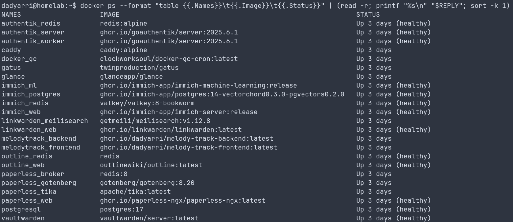
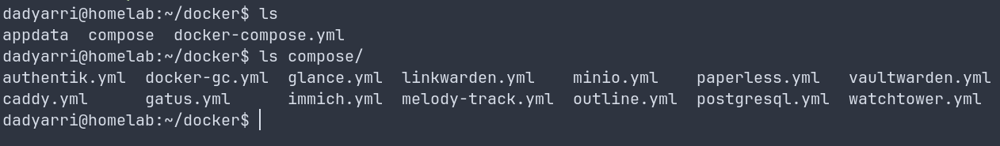

Раньше я экспериментировал с разворачиванием домашней лаборатории на VDS у стороннего провайдера. Хотя оно работало достаточно неплохо, но я решил перенести всё на мини-компьютер у себя дома. Расскажу о том, почему я пришёл к этой мысли, как происходил перенос и что из этого вышло.

<!--more-->

# Почему локальный сервер?


Основной мотив -- **экономия**. Ежемесячные платежи за виртуалку (&asymp; 2-3 тысячи рублей) быстро растут, а я не нуждаюсь в масштабируемости и гибкости хорошего облака, которым пользовался: мне нужен лишь небольшой набор сервисов (несколько приложений и хранилища для них, типа Postgres или Redis) для личного использования и пет-проектов.

- Фиксированная цена -- мини-пк стоит не так дорого, потом расходы почти нулевые за счёт энергоэффективного процессора;
- Контроль -- всё необходимое находится в прямом доступе в любое время;
- Безопасность -- намного надёжнее, когда все данные находятся в соседней комнате;
- Полезный опыт -- навыки администрирования Linux не бывают лишними.

# Выбор железки

О том, какой сервер взять я думал не очень долго. Меня в первую очередь интересовал баланс между производительностью и ценой. Много хранилища мне нужно не было, как медиа-сервер для загрузки фильмов я сервер использовать не собирался, и в итоге выбор пал на какую-то китайскую железку с одного маркетплейса. Бонусом там шла лицензия винды, но я в неё даже не загружался -- сразу снёс и поставил Debian.


# Подготовка операционной системы

За неимением лишнего монитора, мне пришлось временно перенести свой, чтобы базово настроить свежеустановленную систему. В первую очередь -- подключение к интернету, обновление пакетов и установка SSH. Всё остальное можно будет сделать удалённо. 


# Установка софта

В центре стека я поставил Docker. Большое количество приложений для самохостинга уже запакованы в контейнеры, потому это самый простой способ деплоя. Управляет всей мешаниной контейнеров Docker Compose.



Многие приложения сохранились с прошлой статьи, но изменился способ деплоя. Раньше я использовал Nginx Proxy Manager -- утилита, которая работала в отдельном контейнере и позволяла привязывать домены к портам на хосте и настраивать Let's Encrypt сертификаты. Хотя оно работало, но это было не так удобно -- оставался доступ к приложениям по HTTP через IP сервера и порт приложения, настройка происходила через упрощенный веб-интерфейс, который тоже нужно было высвечивать наружу.

В этой итерации лаборатории я использовал Caddy -- веб-сервер, который можно подключать к сетям Docker и использовать контейнеры напрямую, без необходимости открывать порты. Кроме того, он автоматически занимается оформлением и продлением Let's Encrypt сертификатов по умолчанию.

Задача Caddy простая -- слушать 80 и 443 порты сервера и перенаправлять запросы на нужные приложения в зависимости от поддомена и/или пути:

```yaml
services:
  caddy:
    image: caddy:alpine
    container_name: caddy
    restart: unless-stopped
    cap_add:
      - NET_ADMIN
      - NET_BIND_SERVICE
    ports:
      - "80:80"
      - "443:443"
      - "443:443/udp"
    volumes:
      - $DATADIR/caddy/config:/etc/caddy
      - $DATADIR/caddy/site:/srv
      - $DATADIR/caddy/data:/data
    networks:
      - caddy
```

Сам конфиг Caddy при этом прост и понятен: домен и директива о том, на какой хост проксировать:

```caddyfile
auth.example.com {
	reverse_proxy authentik_server:9000
}

photos.example.com {
	reverse_proxy immich-server:2283
}
```

Каждый контейнер, который должен быть доступен по своему поддомену, должен быть подключен к общей с веб-сервером сети (в моём случае это `caddy`). Тогда Docker автоматически определит IP-адрес контейнера по названию сервиса из Docker Compose.

При таком большом количестве контейнеров `docker-compose.yml` неизбежно будет расти, поэтому я разбивал описания приложений на отдельные файлы и импортировал их из основного `docker-compose.yml`:



```yaml
networks:
  default:
    driver: bridge
  caddy:
    name: caddy
    driver: bridge
    ipam:
      config:
        - subnet: 192.168.90.0/24

include:
  - compose/caddy.yml
  - compose/postgresql.yml
  - compose/immich.yml
  - compose/linkwarden.yml
  - compose/docker-gc.yml
  - compose/authentik.yml
  - compose/vaultwarden.yml
  - compose/gatus.yml
  - compose/glance.yml
  - compose/paperless.yml
  - compose/outline.yml
  - compose/melody-track.yml
  - compose/minio.yml
```

Так же рядом с `docker-compose.yml` лежит общий `.env` файл, из которого все приложения могут брать нужные для себя переменные окружения. Сделано это так было потому, что есть общие для всех контейнеров переменные:

```sh
PUID=1000
PGID=1000
TZ="Europe/Moscow"
DATADIR="/home/dadyarri/docker/appdata"
HOSTNAME="homelab"
```

## Менеджер фотографий


## Авторизация

# Безопасность

# Настройка сети

# Итоги и планы на будущее

