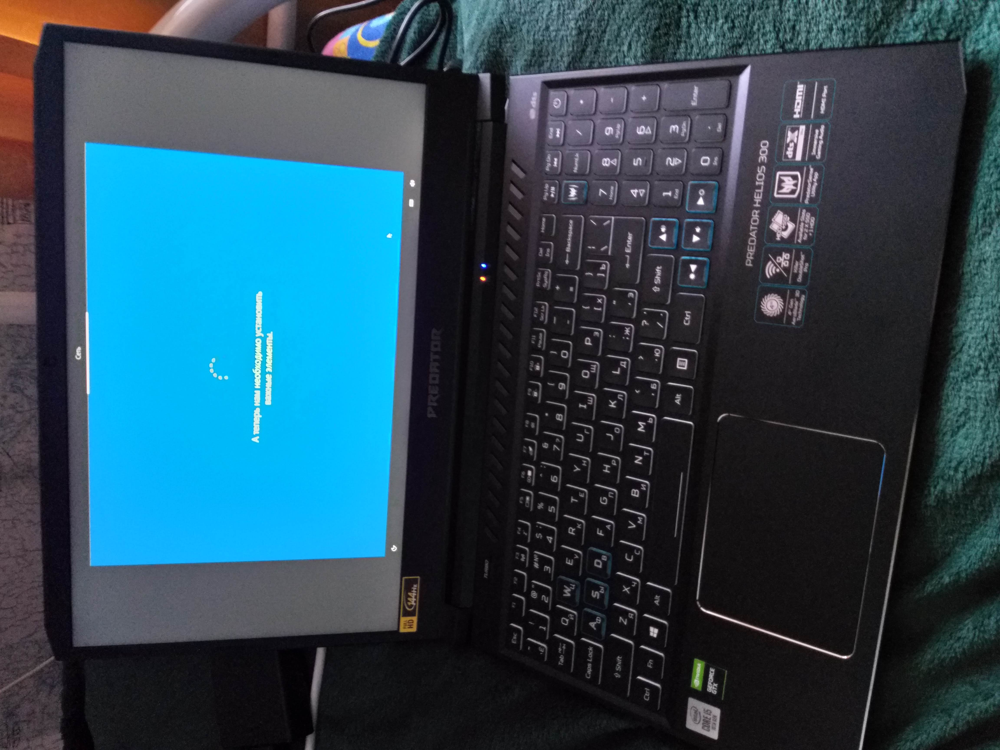
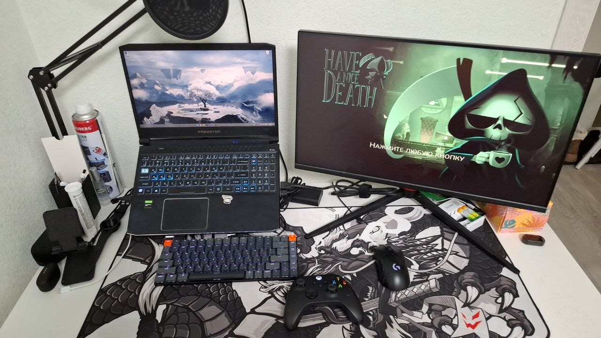
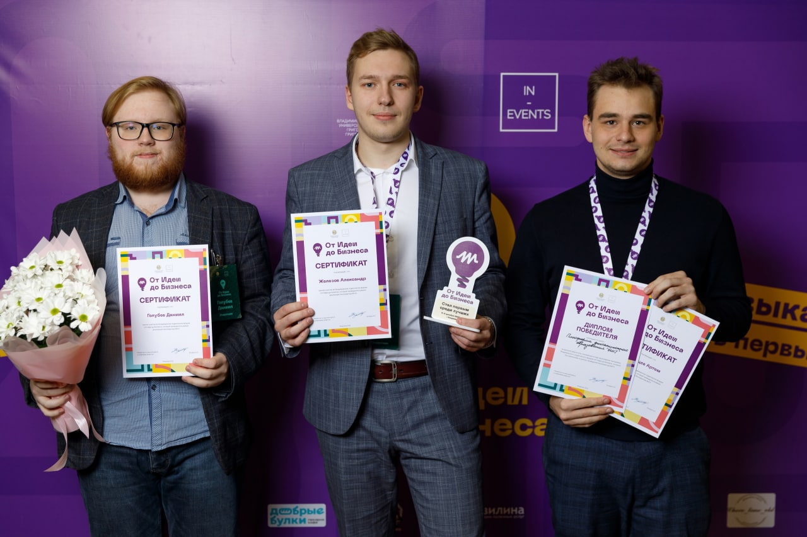
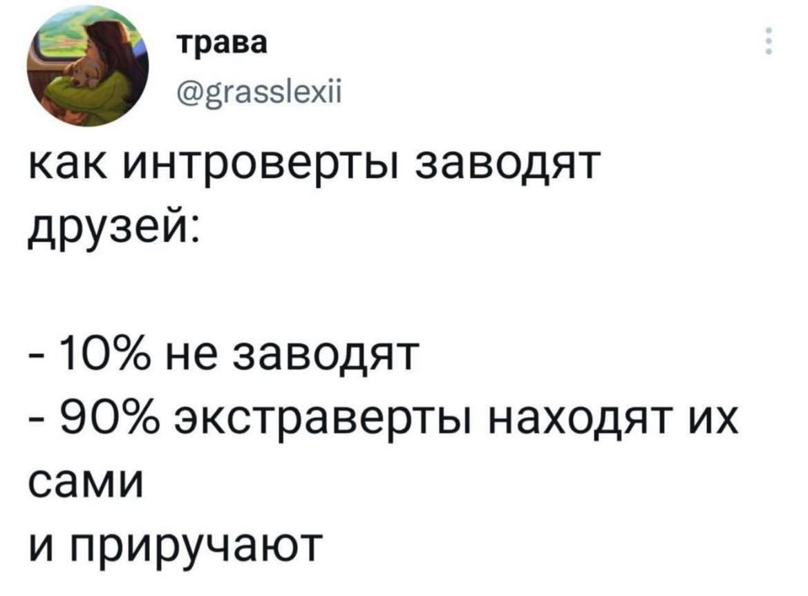
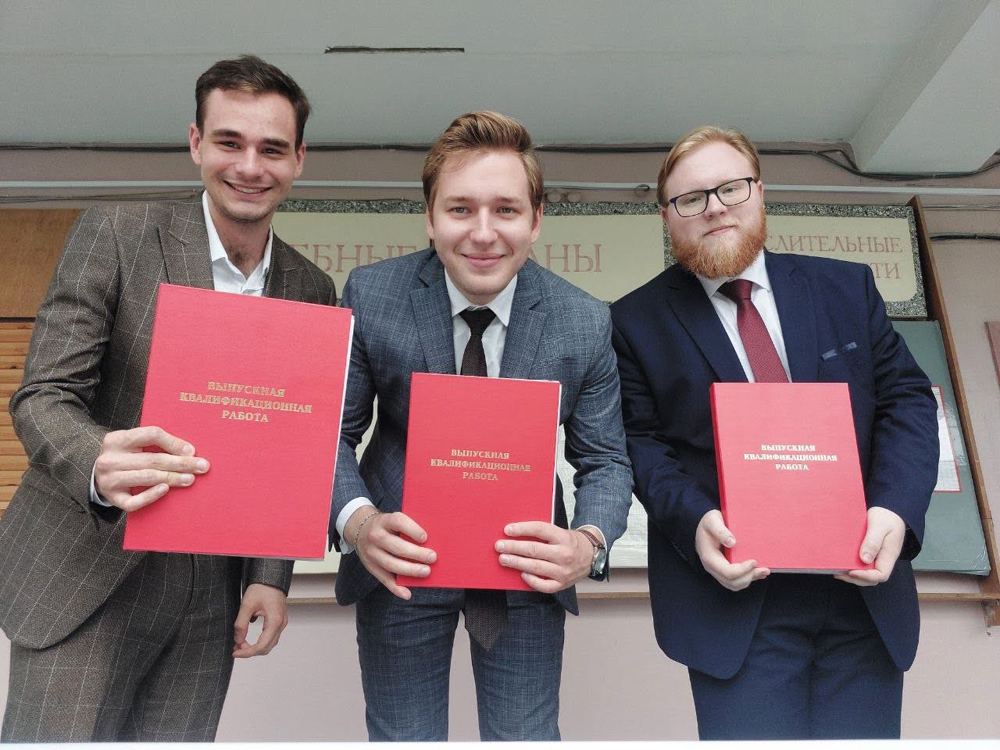

В прошлом году я закончил бакалавриат по направлению &laquo;Информационные системы и технологии&raquo; наконец дошли руки рассказать о том, как это было и что я из этого вынес.

<!--more-->

Последние 4 года я провёл в региональном вузе в новом для себя городе и всё это время жил в общежитии. Общежитие, прямо скажем &mdash; паршивое. Тараканы, поехавшая коменда и прочие радости жизни прилагались. 🥲

На втором курсе мне повезло выиграть в конкурсе рандома игровой ноутбук, которым до сих пор пользуюсь. Как бы я без него выживал на айтишной специальности &mdash; даже и не знаю.

Примерно там же я с друзьями участвовал в нескольких стартап-конкурсах с довольно любопытной идеей системы дистанционного образования (может быть не слишком оригинальной, но были проблемы, которые мы пытались решить), которой я постепенно проникся и у меня появился интерес заниматься этим проектом. Но в какой-то момент у нас перестало хватать сил и времени на поддержание этой идеи, да и отсутствие значимых результатов в конкурсах тоже сказалось.

Этот проект мы довели до логического конца в виде ВКР и больше им не занимались.

В процессе обучения я сменил свою основную технологию с Python на .NET, полюбив его, как ни странно, благодаря отличному преподу, и сейчас это моя основная специализация, хотя иногда фана ради я и пробую другие технологии.

**Система образования не лишена проблем:**

Преподаватели в большинстве своём работают &laquo;по привычке&raquo; &mdash; не повышая квалификацию, не обновляя свои знания, просто продолжают делать то, что делали годами, если не десятилетиями. При этом это либо &laquo;старая гвардия&raquo; с синдромом вахтёра, искренне убеждённые в абсолютной необходимости своего предмета (отсюда огромное количество требований), либо преподаватели &laquo;вторичных&raquo; предметов, которые перестали пытаться убеждать студентов в необходимости их предмета и ведут (даже, возможно, что-то полезное) очень пассивно и неинтересно, что порождает отсутствие интереса со стороны студентов.

Меньшинство же это либо недавние ассистенты кафедры, которые только что законичили своё образование и ещё не успели устать, либо приглашённые профессионалы из отрасли, которые передают знания, которые действительно нужны на работе, чтобы потом пригласить работать к себе, что весьма неплохо, кстати.

Учебный план безнадёжно устарел. Ведь по своей сути это огромная пачка документов, которая обновляется раз в вечность и перед этим должна пройти множество согласований. Я где-то слышал высказывание *&laquo;книга по программированию успевает устареть, пока доберется от рукописи до прилавка&raquo;*, с которым я согласен не полностью (есть неустаревающие книги, это зависит от темы), но ситуацию с образованием она описывает отлично: если книга успевает устареть за производтственный цикл, то чего же ожидать от неповоротливого образования?

Да, местами кто-то пытается что-то менять, но это либо не получает распространения, либо получается очень поверхностным.

Лабораторные работы. Чёрт, кто-то же это придумал. Возможно на других специальностях, которые более связаны с производством (архетиктура? химия?), они и имеют смысл, но у нас в ИТ, кажется, этот смысл теряется, потому что они превращаются в бесконечный парад "попробуйте этот функционал, другой и ещё вот этот, и разберитесь в том, чего не было на лекциях и напишите огромный отчёт-документацию по программе". Бр-р-р-р. Короче, лабы создают только головную боль и впустую тратят время, которое можно было бы с пользой потратить на курсовики.

Впрочем, это всё мелочи, которые при нужном подходе легко обойти. Преподаватели &mdash; тоже люди и с ними можно договариваться.

Моё обучение сложилось весьма неплохо, на втором курсе меня подобрали одногруппники с подвешенным языком, благодаря которым большая часть проблем решилась силой слов. Ну а оставшиеся &mdash; коллективным разумом.

> Первые два-два с половиной года &mdash; самые сложные: сначала ты работаешь на репутацию, потом она работает на тебя.

С одним преподавателем мы договорились сделать ему новый комплект лекций в обмен на зачёт лабораторных работ. Всем от этого хорошо &mdash; преподаватель заменил устаревшие презентации новыми, а мы не делали душную ерунду и сосредоточились на курсаче по этому же предмету.

Хотя было много минусов и проблем, порой горели ср~~а~~оки, но всё же оно было достаточно полезно. Не столько в плане того, что давалось на лекциях (пишу эту статью под новый год и уже не могу, по крайней мере из оперативной памяти, вспомнить что-то, что мне пригодилось бы уже после окончания универа), сколько в плане того, что я делал сам:

В какой-то момент меня достали придирки за оформление по ГОСТам (доходило вплоть до измерений пропорций фигур линейкой на мониторе) и необходимость вручную форматировать каждый абзац в Word, так что сначала я нашёл прекрасный шаблон для [Word](https://github.com/konstantin-morenko/report-732-2017), а потом, чтобы вообще исключить необходимость ручной работы со стилями нашёл Asciidoctor и написал к нему [гостовский шаблон](https://github.com/dadyarri/report-template-asciidoc/). С его помощью из простого текстового файла получались прекрасно отформатированные PDF-документы.

Точного ответа на вопрос &laquo;Нужна ли вообще вышка&raquo; я не дам, потому что не знаю, как бы сложилась моя жизнь без неё и вообще это весьма индивидуальная история. Я выбирал направление *(почти)* осознанно (примерно понимая, чем я хочу заниматься), но не имея представления что конкретно там будет (посмотреть учебный план заранее я не догадался). В итоге направление оказалось не про какую-то одну профессию, а, как говорили безопасники у нас на потоке, готовят там &laquo;многопрофильных дебилов&raquo;

Сейчас я работаю по профессии, чем полностью доволен, и это не заслуга универа, а результат моего труда и ошибок. В магистратуру я решил не идти, устал от официального образования, ну его к чёрту &mdash; нервы дороже. В итоге ни о чём не пожалел.