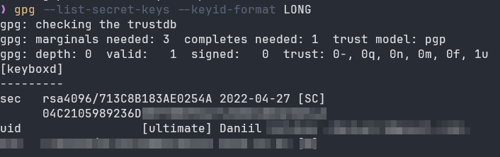

О том, как сохранить GnuPG ключи для удобства переноса между машинами

<!--more-->

# Бэкап

1. Получить идентификатор нужного ключа:

```bash
gpg --list-secret-keys --keyid-format LONG
```



2. Сохранение публичного ключа

```bash
gpg --export --export-options backup --output public.gpg
```

3. Сохранение приватного ключа

```bash
gpg --export-secret-keys --export-options backup --output private.gpg
```

Понадобится ввести пароль от ключа, который был использован при его создании

4. Сохранение схемы доверия

```bash
gpg --export-ownertrust > trust.gpg
```

# Восстановление

1. Восстановление публичного ключа

```bash
gpg --import public.gpg
```

2. Восстановление приватного ключа

```bash
gpg --import private.gpg
```

Понадобится ввести пароль от ключа

3. Восстановление схемы доверия

```bash
gpg --import-ownertrust trust.gpg
```
